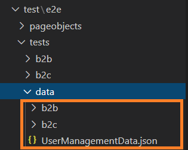

# Commerce React Store Automation Framework

This framework is an e2e testing framework. It has basic set of test cases which includes the main flows from the sample stores. Customer can use this framework to design and run their own set of regression test cases according to the instructions given in this [README.md](/README.md) file.

## Issues

If you find issues/bug please open up an issue in the repo with your node version info along with the stack trace.
See [bug_report.md](/.github/ISSUE_TEMPLATE/bug_report.md) for details on how to raise an issue.

## License

Code is under the [Apache 2.0 License](/LICENSE.txt).

## Pre-requisites

- Install LTS version of `NodeJS` on your client test environment (Latest LTS version - 16.15.1)
- Install `chrome browser` (chrome version should be compatible with chromedriver version mentioned in `package.json`)
- Java installed and added to path
- Storefront should be up and running

## Setup

1. Extract downloaded repository into a new folder
1. Open a command line prompt at the extracted folder and issue `npm install` to install dependencies

## To Setup workspace

1. Launch gitbash and issue `git clone <repository-url>`
1. In Visual Studio Code, open the cloned repository folder
1. Open VSC terminal and issue `npm install` to install dependencies

## Running E2E tests

- Ensure that the storefront is up and running.
- Create a site admin user & update admin credentials inside UserManagementData.json file.
  

  Refer link to create a site admin user & Make sure the user is able to login at storefront.
  https://help.hcltechsw.com/commerce/9.1.0/management-center/tasks/tmsunew_siteadmin.html?hl=creating%2Cusers
- Configure hostname and port number inside `env.config.json`.
- Run `npm test` to execute automated E2E test cases, this will write to the STDOUT  
  --OR--
- Run `npm test | tee output.log`, this will write to the STDOUT and to the `output.log` file.

## Reporting

### Allure Reporter

1. An allure report will be generated if all tests pass
1. If there are any failures, issue `npm run posttest` to generate the allure report.
1. By default allure-report path is set to `./output/reports`
1. In order to open generated report on browser run `allure open <path-to-allure-report>`
1. If allure is not recognized, install it globally `npm install allure-commandline -g`

### Spec Reporter

1. A spec report will autogenerate on STDOUT.

## Developing

### Adding new test to existing repositories

#### <u>PageObjects</u>

1. Setup the workspace as specified above
1. Go to `./test/e2e/pageobjects/pages/<store-type>`
1. Create a new `<pageobject>.po.ts` file

#### <u>Test</u>

1. Go to `./test/e2e/tests/<store-type>`
1. Create a new `<test>-e2e-spec.ts` file

#### <u>Test Data</u>

1. Go to `./test/e2e/tests/data/`
1. Select store-type, add new `<testdata>.json` file

#### <u>Configuration</u>

1. Environment Configuration
   - User can specify env related configuration like hostname, port, timeouts etc using `env.config.json` file.
1. WebdriverIO Configuration (Testrunner Configuration)
   - The configuration file contains all necessary information to run your test. It’s just a NodeJS module that exports a JSON. For details https://webdriver.io/docs/configurationfile.html

#### <u>Enabling logging</u>

- The project uses the webdriverio default logging.
- The logging level can be changed by setting a loglevel in `wdio.conf.js`.
- Webdriver related logs will be saved under `./output/wdio-logs`.
- The available log levels are  
  - trace
  - debug
  - info
  - warn
  - error
  - silent

#### <u>Run Test</u>

1. Open `wdio.conf.js`
1. Add your newly test file path under `specs`
1. Open terminal then run `npm test` or `npm test | tee output.log`

