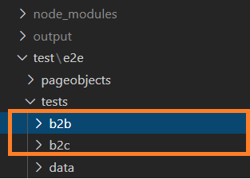

# Commerce React Store Automation Framework
This framework is an e2e testing framework. It has basic set of test cases which includes the main flows from the sample stores. Customer can use this framework to design and run their own set of regression test cases according to the instruction given in the [Readme.md](/README.md).

## Issues
If you find issues/bug please open up an issue in the repo with your node version info along with the stack trace.
See [bug_report.md](/.github/ISSUE_TEMPLATE/bug_report.md) for details on how to raise an issue.

## License
Code is under the [Apache 2.0 License](/LICENSE.txt).

## Pre-requisites
* Install LTS version of `node` on your client test environment (Latest LTS version - 14.17.6)
* Install `chrome` (chrome version should be compatible with chromedriver version mentioned in ./test-react-store-ui/package.json)
* Storefront should be up and running

## Setup 
1. Extract react-store-ui-test.zip into a new folder `<extract_folder>`. Ensure that you see the `<extract_folder>/react-store-ui-test` folder.
1. Open a command line prompt and go to `<extract_folder>/test-react-store-ui`
1. Run `npm install` to install dependencies then run e2e tests

### Setting up workspace
1. Launch gitbash from `/c/gitlab`
    1. git clone `<test-react-store-ui-url>`	
2. Open Visual Studio Code, open folder `/c/gitlab/test-react-store-ui`
3. Open VSC terminal,run `npm install` to install dependencies.

## Running E2E tests
* Ensure that the storefront is up and running.
* Configure hostname and port number inside `/c/gitlab/test-react-store-ui/env.config.json`.
* Run `npm test` to execute automated E2E test cases, this will write to the STDOUT  
  ----OR----
* Run `npm test | tee output.log`, this will write to the STDOUT and to the `output.log` file.     

## Reporting

### Allure Reporter
1. The react-store-ui-test will autogenerate the allure report if all the tests will pass. 
2. In failure case, user can run`npm run posttest` to generate the allure report. By default allure-report path is set to `/c/gitlab/test-react-store-ui/output/reports`
3. In order to open generated report on browser run `allure open <path-to-allure-report>`
4. If allure is not recognized, install it globally `npm install allure-commandline -g` 

### Spec Reporter
1. The react-store-ui-test will autogenerate the spec report on STDOUT.

## Developing

### Adding new test to existing repositories

#### PageObjects
1. Setup the workspace as specified above
2. Locate to `/c/gitlab/test-react-store-ui`
3. Goto /test/e2e/pageobjects
4. Create new file to add new `pageobject`

#### Test 
1. Locate to '/c/gitlab/react-ui-test'
2. Goto /test/e2e/tests/
3. Select store-type, add new `test` file

#### Test Data
1. Locate to `/c/gitlab/test-react-store-ui`
2. Goto /test/e2e/tests/data/
3. Select store-type, add new `testdata.json` file

#### Configuration

1. Environment Configuration
    1. User can specify env related configuration like hostname, port, timeouts etc using env.config.json file. 

2. WebdriverIO Configuration (Testrunner Configuration)
    1. The configuration file contains all necessary information to run your test. It’s just a NodeJS module that exports a JSON. For details https://webdriver.io/docs/configurationfile.html
    
   
 

#### Enabling logging

The react-store-ui-test uses the webdriverio default logging. By default logging will be enabled.The logging level can be changed by setting a loglevel in the wdio.conf.js. Webdriver related logs will be saved under `/c/gitlab/react-ui-test/output/wdio-logs`.
The available log levels are  

-   trace
-   debug
-   info
-   warn
-   error
-   silent    

 

#### Run Test
1. Locate to `/c/gitlab/test-react-store-ui`
2. Open `wdio.conf.js`
3. Add your newly test file path under `specs` 
4. Open terminal then run `npm test` or `npm test | tee output.log`

 
